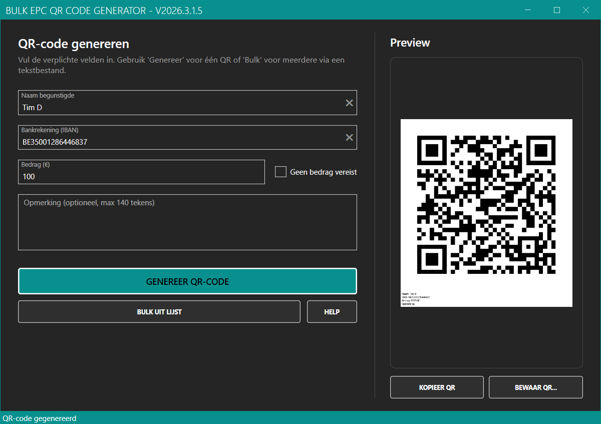

# Bulk EPC QR Code Generator

Desktop WPF (.NET 9) applicatie om EPC/SEPA betaalketen QR-codes te genereren (niet compatibel met Payconiq). Ondersteunt één enkele QR en bulk-generatie vanuit een tekstbestand. De gegenereerde PNG bevat onder de QR-kode ook de leesbare transactie-informatie (Naam, IBAN, Bedrag, Opmerking). De preview en kopieerfunctie gebruiken dezelfde samengestelde afbeelding.



## Belangrijkste features
- Enkele QR-code generatie (Naam, IBAN, Bedrag, optionele Opmerking)
- Preview met onder de QR alle details (tekst altijd zichtbaar op witte achtergrond)
- Kopieer QR + info naar klembord
- Bewaar QR + info als PNG (witte achtergrond, tekst onderaan)
- Bulk generatie uit `.txt` (elke niet-lege, unieke regel wordt opmerking + bestandsnaam)
- Truncatie opmerking naar max 140 tekens (bulk & single)
- Validatie: Naam verplicht (≤ 70), IBAN basispatroon, Bedrag numeriek (locale invoer → EPC formaat)
- Bestandnamen gesaneerd (ongeldige tekens vervangen door `_`)
- Voortgangsbalk en status tijdens bulk
- Automatische versievermelding in windowtitel
- (Optioneel) distributie & auto-update via Velopack

## Limieten & Validatie
| Veld       | Limiet / Regel                                   |
|------------|--------------------------------------------------|
| Naam       | Verplicht, max 70 tekens                         |
| IBAN       | Basis regex check (geen mod-97)                  |
| Bedrag     | Lokaal formaat toegestaan (bv. `12,50`)          |
| Opmerking  | Optioneel, max 140 tekens (afgekapt indien langer)|

Opmerkingregels in bulk worden eerst getrimd, lege of dubbele regels worden overgeslagen.

## Gebruik (Single)
1. Vul Naam, IBAN, Bedrag (en optioneel Opmerking) in.
2. Klik `Genereer enkele QR`.
3. Preview toont QR + tekst; gebruik `Kopieer QR` of `Bewaar QR...`.

## Gebruik (Bulk)
1. Vul Naam, IBAN en Bedrag in.
2. Klik `Bulk uit lijst` en selecteer een `.txt` bestand.
3. Kies doelmap: elke regel → aparte PNG met QR + tekst eronder.
4. Bestandsnaam = gesaneerde regeltekst; opmerking wordt afgekapt op 140 tekens in de QR + tekst.

## Build & Run
### Visual Studio
1. Open `QRPayServiceWaterbaan/QRPayServiceWaterbaan.csproj`
2. Stel project in als startproject
3. Run

### dotnet CLI
```bash
# Build
dotnet build QRPayServiceWaterbaan/QRPayServiceWaterbaan.csproj -c Release
# Run (Debug)
dotnet run --project QRPayServiceWaterbaan/QRPayServiceWaterbaan.csproj
```

## Packaging / Updates (Velopack)
Bij gebruik van Velopack kunnen releases gepackt worden en auto-update aanbieden.
- Tag push met prefix `v` (bv. `v0.3.0`) → GitHub Release & Velopack artifacts
- Applicatie toont nieuwe versie in titel (update-logica kan bij opstart geïmplementeerd worden)

Handmatig packen:
```bash
dotnet tool install -g vpk
# Release build
dotnet build QRPayServiceWaterbaan/QRPayServiceWaterbaan.csproj -c Release
# Pack (pas versie aan)
vpk pack -u "com.timdams.BulkEpcQrCodeGenerator" -v "0.3.0" -p QRPayServiceWaterbaan/QRPayServiceWaterbaan.csproj -f win-x64 -o artifacts
```

## Techniek
- UI: WPF + MahApps.Metro
- QR: QRCoder
- Packaging / updates: Velopack
- Doel: .NET 9

## Privacy
Volledig lokaal; er worden geen gegevens extern verstuurd.

## Bekend (niet geïmplementeerd)
- Geen mod-97 IBAN check
- Geen bedragscurrency validatie buiten EUR

## Credits
- MahApps.Metro
- QRCoder
- Velopack

## Licentie
Zie repository (indien toegevoegd). Voeg licentiebestand toe indien ontbrekend.
